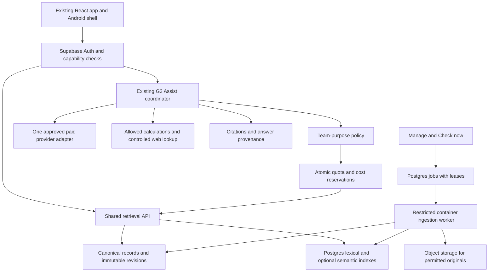

# G3 connected knowledge and team assistant — consolidated design

Date: 20 September 2026. Status: design direction approved by the user, with the added requirement that paid G3 Assist access initially belongs only to Admins and Mentors. This is the controlling design for this increment. It incorporates the production audit, the signed-in Google account review and the subsequent team-purpose restrictions. The earlier architecture review and production audit remain supporting evidence; conflicting design recommendations are superseded here. Paid activation, billing changes and production deployment remain separate release gates. No application implementation is part of this document.

## 1. Outcome and boundaries

Students should find useful engineering evidence, understand it, compare designs, diagnose problems, plan tests and preserve what the team learns. Search should answer discovery questions without paid generation. G3 Assist should turn relevant evidence and supplied measurements into useful explanations and proposals within the team's scope.

Extend the existing FRC knowledge, Evidence search, Robots & mechanisms and G3 Assist. Keep current article ownership, conversations, images, issue/task actions, permissions and deep links. One knowledge workspace presents these capabilities coherently; they share retrieval but preserve different kinds of information.

This increment delivers production-capable knowledge ingestion/search, evidence-backed assistance and team-use controls. It does not deliver CAD generation, Onshape integration, robot physics calibration, autonomous manufacturing or complete competitive strategy optimization. Their future data can connect through defined interfaces. No CAD upload or GLB is required for knowledge research or the current increment. Existing CAD format support is not changed or newly certified here.

Historical target: 2017–2026 initially, then every new season through configuration. Retain the top-500-per-season collection target where a documented ranking exists, plus official references, useful unranked examples and requested teams. Ranking source/date/method must be recorded; a current ranking cannot silently stand in for a missing historical ranking. This target prioritizes collection, not search access or eligibility. No arbitrary 100,000-record ceiling. Coverage will expand over time and will never be described as complete merely because every collected item was indexed.

## 2. Verified starting point

Full evidence: [production audit](KNOWLEDGE_PRODUCTION_AUDIT_20260920.md), [code review](KNOWLEDGE_ARCHITECTURE_REVIEW_20260920.md).

| Area | Verified position | Design consequence |
|---|---|---|
| Production | Supabase Pro organization, Nano compute, database 40.23 MB | Retain Supabase; qualify compute with the new workload. |
| Local collection | 1,716 versions, 48,797 unique passages, 50,157 citation occurrences, 121.54 MB experimental index | Import existing work idempotently in staging; no repeat collection required to start. |
| Coverage | Candidate sources cover 492 of 3,000 archived ranked target entries, with supplemental sources; this is not complete top-500 coverage | Show inventory gaps and separate candidate attribution from verified facts. |
| Hosted features | Historical collection and new robot/source-management tables are not deployed; production has 1 article and 48 published evidence claims | Local previews cannot be presented as production readiness. |
| Trust | Author can modify article verification; content changes do not invalidate it | Server-enforced review transitions precede reliance on verified articles. |
| Assistant | Eight recent/verified articles, six recent solved issues, privileged context reads, loose citation status, up to eight provider attempts | Replace context selection and execution controls while preserving the assistant UI/history. |
| Selected Google project | G3-6740-AI is Free tier; Gemini 3.6 Flash: 5 requests/min, 250K input tokens/min, 20 requests/day | Shared provider allowances must be coordinated; free tier unsuitable for planned team-wide use. |
| Error history | 404, 429 and 503 categories verified; detailed provider logging disabled | Distinguish configuration, quota and transient failures. Billing alone is not a universal fix. |

The selected Google project was not matched to the deployed secret by revealing/comparing credentials. Its displayed usage supports the relationship but does not prove which application made every historical call. Future production footprint and model quality cannot be measured before staging implementation; these are acceptance gates below.

## 3. User interface and exact flows

Main navigation: **FRC knowledge**. Inside: **Search**, **Ask G3 Assist**, **Robots & mechanisms**, **Team library**, and permission-controlled **Manage**. Retain the global G3 Assist entry and issue-context entry. Existing Evidence links open the corresponding search or robot view with filters preserved. This changes navigation, not existing access grants.

### Search

One query box with a clear **Search** button. Searching does not automatically start a paid generated answer. Optional **Ask G3 Assist** carries the query and explicitly selected results to the existing assistant. It does not send all matches.

Desktop: consistent labels above aligned controls; main results column and a filter panel. Mobile: query first, visible active-filter chips, Filter drawer and Apply/Reset. Browser history, copied URLs and Back restore query/filter state. Filters changing asynchronously cannot display results from an older request under new labels.

General research defaults to **All indexed seasons**, with coverage visible. Questions about rule legality require an explicit season or the team's visibly selected active season; historical material remains available but cannot silently establish present legality. General technical references can be season-independent and versioned by software/component release.

| Filter | Behavior |
|---|---|
| Seasons | Multi-select, All indexed seasons; displays actual coverage, not a promise of every source in those years. |
| Mechanisms/topics | Searchable multi-select with bilingual aliases and categories; Any selected / All selected. |
| Exclude topics | Explicit exclusion of associations/text according to selected result type; not proof a robot lacks a mechanism. |
| Teams | One or more team numbers; exact team lookup; request collection for missing teams. |
| Result type | Source passages, reviewed robot configurations, official references, team articles and resolved issues. |
| Source/authority | Official rulebook/update, vendor/software docs, team build documentation, community discussion, internal team knowledge. |
| Review state | Reviewed facts versus searchable unreviewed passages/drafts, constrained by caller permissions. |
| Applicability | Software/component version and robot context when metadata exists; Unknown is explicit. |
| Language/date | Language and publication/version dates; retrieval date is not substituted for publication date. |

Show a short, diverse first page, up to 20 results. Group repeated passages by document/thread section, expose why each matched, and provide source/year/version/review status. Display only authorized counts; label estimates as estimates. Offer More results rather than downloading all records. Topic-based suggestions such as Explain / Troubleshoot / Compare use known metadata and do not invent coverage.

### Robots & mechanisms

“Elevator + Turret, All selected, 2017–2026” returns robot configurations with documented associations for both. Each card identifies team, robot season/configuration and supporting evidence. A forum mentioning an elevator is a source passage, not automatically a robot fact. Configuration revisions distinguish redesigns within a season.

Documented absence, known presence and unknown are separate. Searching for robots without elevators must not treat an unreviewed or unmentioned elevator as absent. Allow comparison of selected documented robots with sources and Unknown cells; never fill missing dimensions from guesses.

### Ask G3 Assist

One conversation experience with optional starting points: Solve a problem, Explore a design, Understand a concept, Plan strategy, Help the team. The user can simply type. Context chips show season, robot, linked issue, software/controller version and selected evidence; users can correct them. Context is re-authorized on the server.

| Question | Expected answer |
|---|---|
| “Our elevator oscillates while holding a load.” | Relevant controls references and permitted team fixes; observations versus hypotheses; necessary missing measurements; ordered diagnostic tests and expected observations. No invented PID constants. |
| “Compare intake designs for these objects and our available space.” | A small alternatives table with tradeoffs, cited examples, supplied constraints, unknowns and prototype tests. |
| “Which robots used turrets?” | Documented configurations plus separately labelled candidate source passages; coverage limit made clear. |
| “What should our strategy be?” | Request material season/event/robot capability context; separate cited rules, actual scouting data and assumptions. Calculations identify their inputs and rule revision. |
| “Explain torque.” | Team-relevant teaching with robotics examples; no requirement to attach a task first. |

Answer presentation: recommended next action, explanation, alternatives/tests, supporting citations and missing information. Mark sourced facts, team measurements, hypotheses, proposals and calculations distinctly. Clicking a citation opens the exact source location where possible, otherwise the captured excerpt and available locator. A missing/stale source is visible. Do not label an entire answer verified because it contains links.

**Save to team library** creates an editable draft with source/version links and AI-origin metadata. **Create issue/task** previews the exact destination and content, then uses the existing explicit user action and permission check. Assistant suggestions do not silently create records. **Record test outcome** links measurements and outcome to the draft/issue; authorized review can later promote the tested solution.

UI states: retrieving, answering, queued, cancelled, quota reached, provider unavailable, partial source failure, stale evidence and insufficient evidence are distinct. Keep query and unsent text on failure; retry must not duplicate conversations or charges unnecessarily. Search stays usable when AI is unavailable. No fabricated sample evidence in live empty states.

### UI acceptance

English/Hebrew parity; proper RTL with readable LTR code/numbers; keyboard operation and visible focus; accessible labels and status announcements; adequate contrast and mobile targets; consistent rows, spacing and button hierarchy. Verify representative desktop, narrow mobile and Android WebView flows. Screen designs must use the actual existing components and realistic populated/empty/error states. Performance, accessibility and workflow correctness are part of acceptance, not final cosmetic cleanup.

## 4. Topic catalogue and evolving search

Use stable topic IDs, bilingual names, aliases, categories, hierarchy and taxonomy revision. Initial domains include drivetrain (tank, swerve, mecanum, traction, gearing), manipulation (elevator, arm, wrist, gripper, intake, indexer, hopper, feeder, shooter, turret, climber, deployment/folding), controls (PID, feedforward, motion profiles, state estimation, sensors, vision, odometry, autonomous/path planning), software/WPILib, electrical/power/pneumatics, CAD/mechanical design, materials/manufacturing, reliability/testing, rules/strategy/scouting and team operations.

This is an extensible catalogue, not a claim to enumerate every future concept. Different relation types prevent treating turret and shooter as synonyms. Ambiguous terms such as deployment distinguish software deployment from a deploying mechanism.

Authorized managers add/rename/merge/deprecate topics and aliases without a code release. Lexical aliases can match existing text immediately; a queued backfill updates stored classifications, facets and optional embeddings. Show that progress. Automated labels are candidate metadata with their derivation recorded; new labels do not create reviewed robot facts. Merges preserve old URLs/IDs through aliases and audit history.

## 5. Team-purpose enforcement and roles

Enforce policy at the backend before each paid step, not just in the model prompt or UI. Re-check every conversational turn, because a valid opening question can turn into unrelated chat. Passages, images and tool results are untrusted evidence, never instructions granting capabilities.

| Request | Policy |
|---|---|
| Robot engineering, FRC rules/strategy, scouting, relevant learning, team procurement/manufacturing/safety/outreach/sponsorship | Allow within record permissions and budget. |
| Broad programming/math/writing with unclear purpose | One short clarification about the team task. Do not force clarification when existing context establishes relevance. |
| Unrelated homework, entertainment, personal services, general image generation | Decline with a team-relevant redirect. |
| Expensive extended research | Requires the dedicated capability and a bounded approved job; student sees a mentor-request flow. |
| Attempts to override restrictions, encode unrelated work or misuse tools | Same server policy; attempts throttled and auditable. “For FRC” alone is not sufficient justification. |

Pipeline: authentication and request-size/rate checks → cheap deterministic checks → when needed, bounded relevance classification → allow/clarify/decline → authorized retrieval → bounded generation → support and scope checks before final delivery. Classifier usage is itself reserved/accounted before calling it. Classification failure does not open unrestricted paid chat: retain search and offer retry/clarification. Structured classifier output is data, not permission; backend capability rules remain authoritative.

All student model/tool calls go through the server. No user-supplied provider endpoint/model/tool list/API key. No image-generation tool or model enabled for any role in this increment. Robot-photo diagnosis is supported separately. No arbitrary SQL, shell/code execution, CAD mutation or robot control. Calculations use defined unit-aware operations. Generated code snippets are proposals, not automatically executed or deployed.

Roles are capabilities mapped to existing grants, not wholesale replacement roles:

**Approved initial G3 Assist access:** add a dedicated `use_g3_assist` capability to the existing role/permission system. Seed Admin and Mentor as allowed; Team Leader and Member as denied. Preserve other roles with a deny default. Do not create duplicate Admin/Mentor roles or grant access merely because someone is an active member. The permissions UI exposes a clear “Use G3 Assist (paid AI)” control; only authorized administrators can change grants, with an audit record. Team Leaders can later be enabled through this control without a code release. Students retain existing authorized deterministic search and library access independently.

Enforce this capability server-side before any paid classifier, embedding, generation or web-tool call triggered through G3 Assist. Apply it to the main assistant page, global popup, issue-context assistant, image analysis, follow-up turns, queued executions and direct API requests. Disabled roles see no active paid action; direct navigation receives an accessible explanation. Never rely on hiding a button. General search must use its deterministic path for users without paid-AI access; optional paid semantic query processing needs an explicit authorized path rather than silently bypassing this restriction.

Re-check grants before queued work or retries begin; revocation stops future paid steps, aborts active work where possible and reconciles incurred costs. Existing conversation read access remains subject to its current ownership rules; losing paid-use permission does not itself delete history. Changing role permissions does not raise spending limits or authorize expensive research. Acceptance must include Admin/Mentor allowed, Team Leader/Member denied across all entry points and direct API calls, administrator enablement of Team Leaders, and revocation during queued work. This initial rollout supersedes any implication below that ordinary members receive AI access at launch.

| Capability | Student/member | Designated mentor/reviewer | Admin |
|---|---|---|---|
| Search/read | Only already-authorized records | Only authorized records | Authorized administrative scope |
| Team AI | Disabled initially; Team Leaders also disabled until explicitly enabled | Enabled initially, subject to budgets | Enabled initially; configure policies/budgets; still team-purpose constrained |
| Create/edit draft | Existing ownership/record permissions | Existing grants | Existing grants |
| Verify/reject revision | No | Explicit reviewer grant | Explicit review authority |
| Manage sources/topics | No by default | Only if delegated | Yes |
| View usage | Own usage | Delegated team summary | Team usage and restricted audit |
| Suspend AI access | No | Only if delegated | Yes; regular search access remains governed separately |

No automatic disciplinary action from one refusal. Allow a student to explain relevance and a reviewer to resolve false positives. A reviewer override is scoped to a specific legitimate task, logged and time-limited; it is not an unrestricted-chat switch. Admins see category, cost, failure/block reasons and repetition; private prompt inspection is limited to designated oversight and disclosed to students. Proposed diagnostic retention is 30 days, with compact cost/security aggregates retained longer under an explicit policy; existing user-saved conversations remain governed by their retention rules. Do not enable vendor prompt logging by default.

## 6. Architecture and deployment shape

Use modules in the existing project: React for UI; Supabase Auth/Postgres/RLS for identity, canonical data and permissions; Edge handlers for bounded authenticated APIs; a versioned container worker for longer fetch/extraction/index jobs. Start with one worker and a Postgres job table with atomic claiming/leases. `pgmq` and `vector` are not currently installed; do not assume they exist. Container host selection is an explicit deployment prerequisite; it needs managed secrets, restart/logging controls and no public unauthenticated ingestion endpoint. Developer laptops and browser tabs are not production workers.

Keep search stateless and bounded. Identity/team/capabilities are server-derived. Use caller-scoped SQL/RPC and restrictive storage access; privileged workers can write ingestion data but are not the interactive retrieval authorization path. Recheck access at citation opening, answer delivery and action creation. Counts/facets/caches must not reveal restricted data. Multi-team ownership fields prepare new records, but full multi-tenant hosting requires separate legacy authorization migration/testing before claims of tenant isolation.

Service contracts (logical interfaces, not commitments to new duplicate services):

| Contract | Input | Output |
|---|---|---|
| Search | Query, typed filters, purpose, cursor | Authorized ranked cards, facets, cursor, index generation, coverage/freshness |
| Ask | Request ID, prompt, conversation ID, selected evidence/context IDs | Execution ID, progress, answer segments, citations, usage/error state |
| Cancel | Execution ID | Cancellation acknowledged; pending work stopped, incurred usage reconciled |
| Check sources | Season/connector scope, request ID | Coalesced job group and stage progress |
| Request team/source | Team-season or URL and purpose | Existing inventory match or bounded discovery job, pending/blocked/available status |
| Review | Revision ID, expected revision, decision/reason | Audited privileged transition or concurrency conflict |

## 7. Data contracts and trust

Add compatible tables/revisions around existing records and preserve old IDs through explicit mappings. No destructive replacement migration in the initial release.

| Entity | Required semantics |
|---|---|
| Source | Stable identity, canonical URL/aliases, publisher, type, visibility, owner, rights/retention and connector |
| Source version | Immutable hash, source ID, fetched/published dates, software/season context, original file reference, extraction version and supersession |
| Text content / passage occurrence | Deduplicated content plus stable version/page/post/line occurrence IDs, language and extraction quality; duplicates retain attribution |
| Claim revision | Assertion, evidence occurrence IDs, applicability, units/polarity, review state/reviewer and previous revision |
| Robot configuration and association | Team, season, configuration version, topic/entity links, evidence and documented presence/absence/unknown |
| Team article revision / experiment | Existing article/issue link, author, content, AI origin, supplied measurements/test outcome, citations, review history |
| Season and rules package | Season/game, authoritative source revision, publication/currentness; reviewed scoring model when available |
| Topic / alias / classification | Stable concept, language, hierarchy, taxonomy version, manual/derived status |
| Job / execution / attempt / budget | Idempotency, scope, lease/state, provider/model, policy/prompt/retrieval versions, reserved and actual usage, sanitized error |
| Search generation / evaluation | Schema/parser/ranking/embedding version, source generation, evaluated cases and release decision |

A claim can apply across seasons; a source can describe multiple robots. Publication year, game season and software version are separate. A forum reply quoting another source is not independent corroboration. Preserve disagreements and lineage. Reviewed revisions are immutable: an edit creates a new draft; old review remains attached to the old content. Restrict verification transitions in the database, not only frontend controls. AI drafts never feed back as verified evidence without review.

## 8. Retrieval and answer quality

Deterministic foundation: exact team/rule/error/model lookup, bilingual aliases, indexed lexical search, structured entity filters, grouping/deduplication and reproducible ranking. Source authority depends on the question: current official rules for legality, correct software release for APIs, measured team evidence for its robot, community examples for design exploration. Keep hard filters hard.

For meaning-based questions, evaluate multilingual embeddings and rank fusion against the lexical baseline. Semantic matches cannot bypass permissions, season restrictions or exact identifiers. Precomputed embeddings and optional query embedding calls are distinct from LLM answer generation; account for their cost and permit lexical fallback. Lexical-only search never requires a paid generation call. Enable semantic retrieval only if it improves the English/Hebrew benchmark without harming exact queries.

Return bounded authorized evidence to the model with immutable citation IDs. Code rejects invented/inaccessible citation IDs and incompatible season/version references. Human/evaluation checks judge whether excerpts actually support statements; URL validity alone cannot do that. Preserve low-support uncertainty, show conflicting sources and abstain on unsupported definitive rules. Avoid fabricated confidence percentages.

Current scoring/rules citations can support qualitative strategy in this increment. Exact season optimization requires a reviewed structured scoring model and trustworthy robot/match inputs; declare it unavailable until those are present. Searchable rulebooks alone are not a simulation or validated strategy engine.

## 9. Collection, new seasons and operations

Pipeline: discover → fetch/version → validate/scan → extract → quality gate → index → source-search availability → claim review where needed. Unreviewed passages may be searched when labelled; verified robot attributes and rule interpretations have separate review requirements.

Admin **Check now** checks configured official/publisher sources for the selected season, coalesces duplicate requests and returns progress. At kickoff, selecting 2027 and pressing it discovers the documents already published at known sources. It does not promise that unpublished, inaccessible or unparseable documents are instantly available. New documents flow automatically into searchable passages after quality checks; review-dependent facts remain pending. Unknown source structures require connector maintenance, not silent success.

No five-minute polling. Manual checking is available; scheduled checks are optional, low-frequency and season-aware, configured by an admin. Publisher events are used where supported. Conditional requests and content hashes avoid downloading unchanged documents. Team requests do not allow unlimited crawling: deduplicate, limit scope/bytes/attempts and record source restrictions.

Worker controls: idempotent source/version/stage writes; lease heartbeat and recovery; cancellation between bounded operations; bounded retry with backoff; dead-letter/quarantine states; publisher throttles; allowlisted protocols/domains, redirect and private-network checks; isolated parsers and file/type/size limits. Partial completion stays visible. No exactly-once network assumption.

Changed source versions invalidate dependent currentness and relevant caches. Preserve historical citations where retention permits. Retired/restricted sources are excluded from new answers and revoked from projections/caches; object/index/embedding deletion follows rights policy. Back up canonical records and originals, test actual restoration and rebuild indexes from them.

Manage screen: source coverage by topic/season/team, last success, current versions, failed/quarantined items, review backlog, worker status, ingest progress, spend and error categories. Actions: Check now, retry selected failures, pause connector, request team, manage aliases/topics, review revisions and inspect audit history. Alerts focus on changed authoritative sources or actionable failures, not unchanged checks.

## 10. Provider, cost and failure controls

Decision: one paid primary through a small provider adapter, retaining Gemini and adding OpenAI Responses for a bounded comparison. Paid Gemini is the lowest-change baseline, not a proven quality winner. Candidate models and dated cost illustrations are in the production audit. Model/account capabilities and prices are rechecked before activation. No paid account upgrade or API test is authorized by this design alone.

Use identical authorized evidence and a versioned 60-case EN/HE set. Blind reviewer scoring covers correctness, source support, usefulness, uncertainty, image diagnosis and rule conflicts. Reject either candidate that fails trust gates. If quality is materially similar, retain paid Gemini; select OpenAI when improved measured quality/reliability justifies cost. Keep provider-independent conversation/history/citations in Supabase. No automatic private-data transfer to an unapproved fallback provider.

Proposed initial standard execution settings, to tune downward to actual account quotas: one active request/member, three provider requests/team concurrently, 6,000 retrieved-context tokens, 2,000 billed output-token cap, 45-second total deadline, maximum one transient retry inside that deadline. Also limit total prompt/history tokens; summarization is budgeted if used. All calls including classifiers, embeddings, tools and failed attempts enter the ledger. Apply provider-wide RPM/TPM/day pacing in addition to per-user and team quotas; concurrency alone does not enforce rate limits.

Reserve worst-case permitted spend atomically before each paid step against per-request, per-member and team daily/monthly budgets. Reconcile actual usage separately from chat saving. Identical submitted request IDs return the same execution rather than generating again. Unknown provider charges remain conservatively reserved pending reconciliation. Cancellation stops future steps and propagates abort where supported; it cannot undo consumed compute. Price/version metadata supports cost audit. Monetary limits must be explicitly configured before paid activation; unset means disabled, not unlimited. Proposed warning thresholds: 80% and 95%, stop new paid work at 100% of application budget; retain search.

Error behavior: configuration/auth/not-found → fail clearly and alert operator, no blind retry; hard quota/billing → pause paid work with actionable status; temporary rate limit → queue/Retry-After within deadline; 503/timeout → at most bounded retry, then graceful failure. Circuit breaking prevents repeated failures from consuming the team budget. Show a safe error category and request ID, not secrets/provider payloads.

Web lookup is explicit or policy-triggered for freshness/coverage gaps, not attached to every text question. Bound calls and redact private details from external queries. No image generation. Source ingestion and source search continue independently of provider availability.

## 11. Capacity, security and extensibility

Keep the 500-team target. Current corpus does not justify a dedicated search cluster. Use Postgres indexes and cursor pagination; store permitted binaries in object storage; avoid whole-corpus browser downloads and expensive exact counts on every keystroke. Plan Micro-class or larger compute for qualification, select actual size using hosted staging metrics and confirm billing/downtime before changing production. Pro storage allowance is not a concurrency guarantee.

Measure canonical+index sizes, CPU/RAM/I/O, connections, query plans, p95 latency, ingestion backlog and actual spend. Benchmark current corpus and a 10x synthetic scale fixture; use larger fixtures for decisions only when needed. Synthetic records never become evidence. Increase compute and independently increase workers under source limits; introduce partitioning/search replicas/dedicated search only when measurements justify them. Stable retrieval contracts and rebuildable projections keep such changes out of the UI. Infinite scale is not a finite system property.

Security boundaries: row and column/review permissions; object access and derived-data revocation; private/public deduplication isolation; request/job idempotency; secret rotation without exposure; safe file parsing; prompt-injection tests; narrowly scoped tools; minimal logging; restricted administrative audit; no arbitrary query APIs. Review existing security-definer scouting views before strategy tools consume them. RLS tests cover inactive members and revoked access as well as positive roles.

Future adapters: CAD/Onshape versioned design metadata; simulator runs with model/version/assumptions; telemetry with units/timestamps/calibration; experiments with measurements; manufacturing/BOM with permissions and approvals. These become typed evidence, not free-text guesses from filenames. The knowledge system cannot certify robot physics, manufacturability or safety without the corresponding validated engineering capability.

## 12. Delivery plan, release gates and rollback

Expanded estimate **18–30 engineering days**, excluding account approval, worker-host provisioning delays, physical acceptance and exhaustive historical collection. This replaces the previous 15–25-day estimate by including the newly requested purpose controls, administrator oversight and additional abuse/false-positive evaluations. It is an estimate for the bounded first release, not every future integration.

| Stage | Deliverable the user can inspect | Effort |
|---|---|---|
| 1 — Contracts, UI and trust | Actual-component previews for Search → Ask → Test → Save, role matrix, staging baseline, protected article reviews, request/purpose/budget contracts | 4–6 days |
| 2 — Evidence and retrieval | Existing corpus imported in staging, stable citations, authorized shared search, filters, coverage, worker and Check now progression | 5–8 days |
| 3 — Connected G3 Assist | Relevant context, team-purpose control, bounded provider execution, citations, preserved actions, provider comparison and usage oversight | 5–9 days |
| 4 — Acceptance and release packet | Regression/UI/security/load/restore evidence, final compute/provider settings, operating guide, rollback rehearsal and explicit production decision | 4–7 days |

Work is remote. Physical diagnosis/design recommendations remain hypotheses until workshop measurements/tests support them. No waiting for team CAD access is required for this release.

Acceptance gates:

- Retrieval: relevant evidence in top five for at least 90% of answerable benchmark queries, correct exact IDs and hard filters, zero unauthorized result/count/citation disclosure in the role test suite.
- Answers: all citation IDs resolve to allowed versions; no unsupported definitive rule answers in the test set; mentor-scored usefulness/source support, explicit missing data and uncertainty.
- Purpose policy: add at least 40 EN/HE cases covering relevant learning, ambiguous tasks, unrelated requests, mid-conversation drift, encoded bypass attempts and malicious attachments. All explicit prohibited tools remain inaccessible; no critical misuse bypass in the release set; at least 95% of clearly valid team-learning cases accepted without unnecessary refusal. Borderline cases are reviewed, not scored by the model alone.
- Costs/reliability: concurrent budget race, classifier abuse, duplicate submission, cancellation, provider 404/429/503/timeouts, restart, persistence failure and uncertain-charge reconciliation tests. Search works during provider failure.
- UX: desktop/mobile/Android WebView, EN/HE/RTL, keyboard, aligned controls, readable citations, loading/empty/error states, filter/deep-link restoration and no production fixture evidence.
- Performance: proposed p95 first-page search <=2 seconds with 20 concurrent searches while capped ingestion runs; UI acknowledges cancel <=1 second; record actual provider latency separately from application time. Targets must be measured, not claimed in advance.
- Regression: existing articles/edit/delete, conversations/images/history, tasks/issues, role gates, robot Any/All/absence filters, source checks and unrelated application navigation smoke checks.
- Operations: restore canonical records and permitted originals, rebuild index, restart jobs, source supersession/revocation, connector pause and documented incident response.

Migration: inventory live schema, additive tables/columns, stable legacy ID mappings, resumable import, shadow comparison, feature flags and pilot rollout. Retain old routes/actions and previous index generation. Rollback disables the new features and switches read projections without deleting canonical data; pause new jobs/executions first and reconcile in-flight work. Preserve new writes through compatible storage or explicit replay mappings. Do not revert the article-verification security fix as part of a UI rollback. No destructive cleanup until after stable acceptance.

## 13. Decisions now and gates before release

Decided architecture: existing workspace/assistant, shared authorized retrieval, immutable evidence/review revisions, 500-team collection target, configurable seasons/topics, deterministic baseline search, bounded optional semantic retrieval, durable worker, paid provider adapter, enforced team purpose, disabled image generation, measurable release/rollback gates.

Before paid tests: selected accounts and permitted data use, bounded test spend and configured budgets. Before deployment: worker host/secrets, final compute and billing, selected model based on evaluation, validated permissions/restore and reviewed release evidence. These are explicit activation gates, not unanswered architectural questions. They must not be silently interpreted as approvals.

Evidence limits: exact historical provider error causes remain unavailable; current live model override/credential association has not been inspected; future hosted performance and model quality require the planned tests; coverage is incomplete; hardware outcomes need physical acceptance. No guarantee of zero future regressions or universal answer accuracy replaces these controls.
