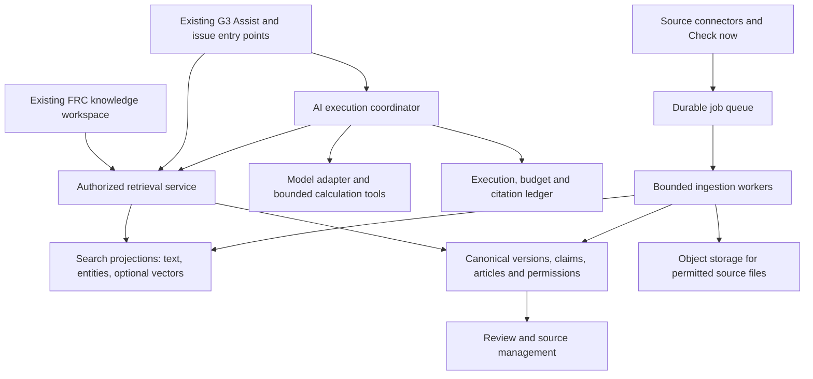

# Connected FRC knowledge: code review and proposed architecture

Status: design proposal, revised 20 September 2026 following a read-only production audit. Read [Production audit and revised decisions](KNOWLEDGE_PRODUCTION_AUDIT_20260920.md) first; it takes precedence where this initial code review differs. Deployed policies/grants/triggers, assistant code, database size and organization usage have now been inspected. Provider account quotas and future-workload benchmarks remain explicit gates. No application changes, deployment, production data/schema changes, import or paid model calls were performed for these reviews. Extend the existing G3 Assist and knowledge workflows instead of building a second assistant. Approval of this document is not approval to deploy.

## Decision

Use one FRC knowledge workspace, one permission-aware retrieval contract, and the existing G3 Assist. Keep authoritative source versions, reviewed claims, robot configurations, team articles and AI proposals as distinct record types. Unify discovery and interaction without erasing provenance, permissions or review status.

Start on the existing React / Supabase architecture, with server-side retrieval and independent durable ingestion workers. Do not introduce a new chatbot, graph database, search cluster or microservice fleet before measured need. A searchable index is a rebuildable projection, not the system of record.

There is no infinite-capacity system or defensible promise of zero regressions. Design for measurable capacity, increasing worker capacity, index replacement and controlled migrations. Establish release gates and rollback rather than claiming perfection.

## Scope and evidence

Read the knowledge workspace, Evidence page and its helpers, robot research component and SQL, local corpus adapter/index/builder, G3 Assist frontend/backend and save actions, Chief Delphi connector, source-check handler, source/evidence/assistant/knowledge SQL and relevant permission overrides, and route integration. This is a focused static review of the relevant paths, not an exhaustive audit of the entire repository or deployed policies. Existing acceptance evidence was reused; unchanged baseline tests were not rerun.

Key references (paths relative to repository root):

- `apps/dashboard_web/src/components/FrcKnowledgeWorkspace.tsx`
- `apps/dashboard_web/src/pages/KnowledgeEvidencePage.tsx`
- `apps/dashboard_web/src/components/RobotResearch.tsx`
- `apps/dashboard_web/src/components/CollectedSourceResults.tsx`
- `apps/dashboard_web/src/lib/knowledgeEvidence.ts`, `knowledgeSources.ts`, `collectedSources.ts`
- `apps/dashboard_web/src/pages/FrcAssistantPage.tsx`
- `apps/dashboard_web/src/main.tsx` (knowledge route, assistant route, web assistant modal)
- `backend/supabase/functions/frc-assistant/index.ts`
- `backend/supabase/functions/chief-delphi-feed/index.ts`
- `backend/supabase/functions/knowledge-source-check/index.ts`
- `backend/supabase/frc_intelligence_phase_20260830.sql`
- `backend/supabase/frc_assistant_20260829.sql`
- `backend/supabase/knowledge_evidence_pilot_20260913.sql`
- `backend/supabase/lab_screen_permissions_20260913.sql`
- `backend/supabase/knowledge_source_checks_20260920.sql`
- `backend/supabase/robot_research_20260920.sql`
- `apps/dashboard_web/scripts/collection-review-plugin.mjs`
- `docs/research/build-isolated-corpus.mjs`

Measured local corpus: 1,716 source versions, 48,797 unique passages, 50,157 citation occurrences, 121,544,704 indexed bytes. No new confirmed robot facts. These are experimental local relation sizes, not hosted capacity or full top-500 coverage. See `research/FULL_COLLECTION_20260920.md` for coverage gaps.

## Findings that change the design

| Finding in current code | Consequence | Required change |
|---|---|---|
| G3 Assist already supports conversations, images, issue context, web citations, Save knowledge, Create issue and Create task. | A second assistant would duplicate workflows and split history. | Reuse this assistant; pass research context and selected evidence into it. Keep its existing entry points and actions. |
| Assistant selects eight articles by verification/recency and six recent resolved issues; neither retrieval is question-ranked. | Relevant older team solutions can be omitted. | Retrieve authorized relevant article/issue revisions through the same search service used by the UI. |
| FRC knowledge filters loaded articles using substring matching; reviewed evidence downloads rows in 500-row batches then filters in the browser; robot search uses a paginated SQL function; corpus uses English full-text search. | Inconsistent results, unnecessary downloads, weak bilingual behaviour and hidden pagination limits for unbounded article queries. | Server-side bounded retrieval, shared filter definitions, bilingual evaluation and stable pagination. Do not concatenate all tables in the browser. |
| Chief Delphi query path returns at most 30 posts. Its nonempty-query branch ignores the submitted subsystem/feed selection. | The visible subsystem filter does not consistently constrain external results. | Declare each connector's filter support; apply supported filters or show explicitly that a source cannot honour them. Never silently imply universal filtering. |
| Collected-source service is injected by the preview. Production route renders KnowledgeEvidencePage without it. Local PGlite index is built from a local bundle. | Current corpus UI is not a production retrieval deployment. | Authenticated corpus ingestion and search service, with rollout flag and staging acceptance. Retain local adapter for QA only. |
| Assistant verifies active membership, then reads articles/issues using service role, including a caller-supplied issue ID. | Membership alone is not sufficient authorization for every context source, especially when adding permission-restricted evidence. | Resolve readable records through caller permissions before prompt construction. Verify every selected context ID. Service role must not become a retrieval bypass. Current production exploitability was not tested. |
| Evidence has a separate `view_evidence_search` permission; the existing knowledge library and assistant use different access paths. | Merging navigation could inadvertently widen access or hide existing team knowledge from members. | Preserve current grants; define read-library/read-evidence/use-AI/review/manage-source capabilities explicitly. Apply them to results, counts, snippets, facets and assistant context. |
| Article schema has a `verified` boolean. Author updates are allowed by the supplied policy; UI content edits do not clear that boolean. | Verification can remain attached to changed content. The reviewed SQL does not show column-level protection for verification. | Immutable article revisions and a privileged review transition tied to the reviewed revision; edits require re-review. Confirm actual grants/triggers in staging before asserting a live vulnerability. |
| Assistant `grounded` is computed from the presence of any citation. | A citation list is not proof that each factual claim is supported. | Claim-to-citation links and source/version checks; classify evidence support separately from whether web links exist. |
| Daily limit counts saved user messages before executing; usage is persisted with chat after success. | Concurrent requests can pass the same check; failed executions or save failures can escape accounting. | Atomic budget reservation, separate execution/usage ledger, idempotency, reconciliation and bounded retries. |
| Source Check now fingerprints/discovers documents; full corpus extraction is a separate local pipeline. | Discovery is not indexing, review or automatic availability to the assistant. | Durable staged ingestion with explicit states; UI shows discovered/downloaded/extracted/indexed/review-required separately. |
| Source model uses one required season; topic-evidence uniqueness allows one association per topic/claim revision; reviewed robot must match source year. | General technical references and multi-season comparison documents do not map cleanly; one source can describe multiple robots. | Separate source context seasons from claim applicability and robot season; explicit many-to-many attribution with provenance. Preserve current reviewed associations during migration. |
| Topic changes can trigger a synchronous cross-scan of published claims. | Repeating this over a large corpus will lengthen admin writes. | Save taxonomy immediately, increment taxonomy revision and enqueue incremental classification/reindex work. Distinguish lexical matches from verified mechanism attribution. |
| Corpus source IDs are assigned during rebuild; deduplicated text and citations are separate. | Sequential build IDs are unsuitable for saved production answers; duplicates are not independent corroboration. | Stable source/version/chunk/citation IDs; maintain occurrence links and quotation lineage. Retain original attribution and compare independent sources. |

## User experience

One main navigation entry: **FRC knowledge**. Keep G3 Assist accessible globally and in issue workflows. Within knowledge:

1. **Search**: one question/keyword box and a clear Search action. Optional chips: season, topic, team, source type, review status. Search does not automatically start paid answer generation.
2. **Ask G3 Assist**: use the same entered question and selected context. Show current robot, season, software/controller version where known; do not silently infer them. Switching from Search carries selected sources, not an entire 900-result list.
3. **Robots & mechanisms**: structured facts, documented absence, comparisons and historical filters. Preserve the distinction between a text mention and confirmed use by a robot.
4. **Team library**: saved solutions, reviewed articles and team experiments. Search includes authorized library records, but this view remains useful for browsing and ownership.
5. **Manage sources**: permission-controlled administration for connectors, versions, failures, review, coverage and cost.

Search results group repeated passages by source/post or document section. Start with a short relevant set, explain why each matched, show its authority and applicability, and offer more results. Keep filters visible on desktop and in an accessible mobile drawer with an active-filter summary. Use progressive disclosure for evidence details. Preserve English/Hebrew layout, code direction, keyboard control and old deep links.

Example: `our elevator oscillates while holding a load` should surface relevant controls guidance, our own matching resolved issues and useful community examples. It should not require the user to know the term PID. Exact error codes, model numbers, team numbers and quoted phrases retain exact-match behaviour.

Assistant response: **recommended next action → explanation → tests or alternatives → supporting sources → missing information**. For a design question, return a small comparison with the user's constraints and proposed prototype tests. For a diagnosis, ask only material clarifications, track observations vs hypotheses, and update the plan after a measurement. A broad query such as PID can offer Explain, Diagnose and Compare suggestions instead of guessing the user's problem.

Loading, partial-provider failure, stale index, no matches, missing authorization and insufficient evidence must be different states. Search remains usable during AI failure. Do not expose inaccessible titles/counts while explaining authorization.

## Architecture and service boundaries

Implement these as modules and worker responsibilities in the existing project, not necessarily separately hosted microservices. React remains the interface; Supabase Auth/Postgres are the initial authority. Edge handlers perform authenticated bounded API work. Long extraction/OCR/index jobs run through workers with explicit limits, not a browser-driven loop or a long chat request.

Shared retrieval request: query, explicit filters, purpose (search/diagnose/compare/rules), selected context IDs, cursor. Identity and team membership come from authenticated server context, never trusted request fields. Response: stable result ID, record type, safe excerpt, version/locator, applicable seasons/software, authority, review state, match reasons, next cursor, index generation and coverage/freshness status. Assistant consumes the same authorized result IDs, not an independent unrestricted query.

Start with exact lookup, aliases and indexed lexical search. Add semantic candidates for meaning-based questions only after bilingual evaluation demonstrates improved relevance. Merge ranked lists, then group duplicates and diversify useful sources. Numeric identifiers and explicit filters remain hard constraints. Ranking is purpose-specific: current official rules for legality; relevant vendor version for wiring/API; measured team experience for that robot; community examples for design exploration. A more recent but irrelevant page must not win simply because it is newer.

Taxonomy supports stable IDs, bilingual aliases, optional hierarchy and explicit relations. A part, mechanism, subsystem, symptom, technique and game task are different concepts. `Turret` is not automatically equivalent to `Shooter`; `swerve` can be a drivetrain subtype. Query expansion should be visible and reversible. New topics can match existing text immediately; attribution, embeddings and verified fact population are separate operations with observable progress.

## Data model: preserve meaning and provenance

Add compatible structures rather than replacing current working tables in one migration:

- **Source**: canonical identity, publisher, URL aliases, visibility/owner, retention/rights policy and connector.
- **Source version**: immutable fingerprint, fetched/published times, original locator, extraction version, software release or season context, supersession relationship. A historical version remains valid historical evidence even when it is no longer the current rulebook.
- **Passage occurrence**: stable ID, version ID, page/section/post/line locator, normalized text hash, parser metadata and extraction quality. Deduplicate storage without losing location, visibility or citation identity. Never share private hashes/results in ways that leak another team's content.
- **Claim revision**: assertion, evidence occurrences, polarity, units, applicability, review state and reviewer decision. Preserve disagreements; absence requires explicit evidence.
- **Entity and association**: robot configuration/team/season/mechanism/component/software version, linked through separately reviewed claims. Keep title-based candidate associations labelled as candidates.
- **Team knowledge revision**: existing article/issue linkage, author, AI-origin flag, test outcomes and review history. Saved AI suggestions are drafts, not verified evidence feeding themselves back as facts.
- **Search projection / embedding generation**: source revision, parser/chunker version, language, embedding model/dimensions and index generation. Rebuild/swap without changing canonical citations.
- **Execution and evaluation records**: request id, permitted context/version IDs, retrieval/model/prompt/calculation versions, usage reservation, actual provider usage, state and review/feedback. Store minimal sanitized diagnostics with retention limits.

Public source material and private team experience have separate visibility. Initial implementation remains G3; make ownership boundaries explicit for new private data. Full multi-team hosting requires its own tested migration of legacy membership and authorization, not just adding a tenant column and declaring isolation complete.

## Ingestion and manageable operations

Pipeline: discover → fetch/version → validate/scan → extract → quality check/quarantine → index → available for source search → review claims when needed. Indexing does not require manually approving all 48,797 passages; confirming robot facts and authoritative rule interpretations does.

Each job has an idempotency key based on source/version/stage, bounded bytes/time/retries, lease and checkpoint, next eligible retry and cancellation state. Queue delivery can repeat: use idempotent writes rather than assuming exactly-once side effects. Check now enqueues/coalesces work and returns progress. Admin navigation does not stop workers. Respect publisher limits, conditional requests and source retention permissions. No five-minute polling. Use manual checks and low-frequency, season-aware schedules only when configured; supported publisher events can trigger jobs. Kickoff import cannot guarantee every source is already published or parseable at that instant.

Admin screen shows last successful check, current version, available/failed/quarantined counts, searchable coverage by topic/season, missing target sources, stale reviewed claims, backlog age and cost. Allow retry failed items, pause a connector, reprocess a selected version, merge aliases, retire a source, review attribution and view audit history. Alert on actionable failures or changed authoritative sources rather than unchanged checks.

Changed sources create new versions. Mark dependent claims/answers as potentially stale; retain the prior cited version and review history. A withdrawn source is excluded from new answers while saved historical answers show an explicit warning. Source deletion/rights changes must propagate to blobs, search projections, embeddings and caches under a documented retention policy.

## AI execution and trust

Preserve the current provider integration behind a small adapter, but remove reliance on the free tier for production-critical assistance. The production audit specifies paid Gemini as the lowest-change baseline and OpenAI Responses as a controlled comparison candidate, with no unconditional provider cutover before evaluation. Select model/embedding/reranker using measured quality, language support, latency, privacy and cost.

Before paid execution: atomically reserve a per-request budget against member/team/day limits, authorize selected context, record request id, then run bounded retrieval and generation. Reconcile actual usage including failed/retried attempts and storage failures. Block unbounded fallback loops. A cancellation stops remaining steps and propagates abort where supported; already consumed provider work may still be charged.

Treat source passages and uploaded content as untrusted data, never tool instructions. Initially allow only authorized retrieval and validated, unit-aware calculation tools. No arbitrary SQL/code execution, CAD mutation, robot control or autonomous task creation. Preserve explicit existing user actions to create tasks/issues; draft/review before consequential downstream actions.

Every factual answer claim should point to an allowed passage/version or supplied measurement. Validate citation IDs and applicability in code; evaluating whether a source truly supports a claim still needs benchmark/human review, not merely a URL-presence check. Separate facts, hypotheses, proposals and calculations. Do not display an invented numeric confidence score. Ask for missing constraints or explain insufficient evidence rather than generating a definitive answer.

Caches must include access scope, source/index generation, filters, relevant robot/season context and model/prompt version. Revocation and source retirement invalidate cached outputs; recheck authorization at delivery. General public-source results may be shared; private team context and conversation output may not.

For future season strategy, use a versioned, reviewed scoring/rules model and timestamped match/scouting data; compute scenarios with explicit assumptions and sensitivity. Historical design similarity does not establish current legality or predicted competitive performance. CAD metadata, telemetry, simulations and experiments later become typed evidence adapters with units and coordinate/version metadata; do not claim to understand their binary assets from filenames or links.

## Scale, reliability and operating cost

Current corpus size does not justify a separate search cluster. Start with indexed Postgres queries and paginated results; object storage carries permitted originals. Add vectors only when quality gain warrants their storage and execution cost. Existing 121.5 MB excludes vectors, canonical production metadata, originals, WAL, backups and operating headroom.

Proposed initial performance gates, to measure in staging: first search page p95 ≤2 seconds at 20 concurrent searches on the current corpus; cancellation acknowledged in the UI ≤1 second; generation progress visible immediately and an ordinary answer target ≤20 seconds, separately reporting provider delays. These are targets, not observed guarantees or present Pro-plan promises.

Benchmark current, 10× and 100× retrieval loads using generated fixtures clearly distinguished from real evidence. Measure relevance under selective filters, p95 latency, CPU, I/O, memory, index size, backlog, ingest throughput and per-answer cost. Set operational budgets from actual hosted measurements. Keep headroom and alert thresholds. Increase compute/workers and tune query plans first; consider partitioning, replica search or a dedicated search service only if sustained measured load fails the agreed SLO. Keep the retrieval contract stable so these substitutions do not redesign the UI.

Bound work per request, use keyset/cursor pagination for large result sets, avoid expensive exact total counts on every query, and separate ingestion concurrency from interactive search resources. Persist jobs/indexes rather than rebuilding an in-memory database per server start. Verify backup/restore of canonical rows and blobs plus index rebuild procedure; database backups alone are not proof all object files can be restored.

## Migration, acceptance and delivery

1. **Architecture/UX contract:** agree the one-workspace interaction and permission mapping. Produce representative Search → Ask → Test → Save previews using existing components. No extra chatbot.
2. **Production-capable retrieval in staging:** additive versioned schema, stable IDs, permissions, idempotent import, server search adapters for articles/issues/claims/corpus. Shadow-compare against existing results. No production import yet.
3. **Unified workspace:** preserve old URLs through aliases and preserve permission differences. Release behind a flag; keep existing routes available for rollback. Test browser and Android navigation, RTL, keyboard, loading/failure states and small screens.
4. **Strengthen existing G3 Assist:** relevance-based context, citation validation, budget ledger/cancel, bounded execution, provenance-preserving Save knowledge and review transitions. Paid calls require configured budgets and acceptance scope.
5. **Operations and release acceptance:** worker restart/retry tests, source-change invalidation, restore drill, hosted load and cost measurements, mentor-reviewed answer evaluation. Present concrete release evidence and remaining physical acceptance before production approval.

Provisional implementation estimate for a production-ready first increment: **15–25 engineering days**, excluding physical validation, external approvals and exhaustive source coverage. Breakdown: UX/contracts 2–3; shared retrieval/auth/import 4–6; unified UI 2–4; assistant controls/retrieval 4–7; evaluation/operations/release 3–5. Some activities overlap. This replaces the earlier 2–3 week estimate for a narrower feature; actual scope must be fixed after staging grants/provider limits are inspected.

Acceptance set: at least 60 versioned cases across EN/HE, exact errors, cross-language questions, troubleshooting, design alternatives, rules/year conflicts, negative evidence, missing facts, malicious source text, permission denial, stale revisions, duplicate quotations and provider failures. Compare to the existing assistant/search baseline. Initial goals: a relevant result in top five for ≥90% of answerable benchmark queries; 100% resolvable allowed citation IDs; zero unauthorized-content disclosures in adversarial tests; no unsupported definitive rule answers in the rules test set. These are release gates on a finite test set, not promises about all future questions. Mentors judge usefulness and source support separately from model self-assessment.

Regression gates preserve: existing article edit/save/delete and source links, assistant history/attachments/task and issue handoff, robot all/any/absence semantics, review conflicts and retirement, source check cancellation/leases, grant revocation, and EN/HE mobile accessibility. Rollback disables the new route/service flags and index generation without deleting canonical source data. Additive migration and a verified rollback plan precede rollout; destructive schema cleanup is later work.

## Uncertainty that must remain visible

- Superseding production audit: relevant live grants, column permissions, policies, triggers, deployed assistant source, Pro usage and Nano compute were inspected. Article verification protection is a confirmed gap. Historical migration order was not reconstructed; the signed-in follow-up verified Gemini 3.6 Flash quotas (5 requests/minute, 250K input tokens/minute, 20 requests/day) and historical 404/429/503 responses; detailed logging is disabled. See the linked audit for measured facts and exact remaining gates.
- English/Hebrew semantic model choice, retrieval quality, true hosted concurrency and total AI cost need controlled experiments. No embedding provider or paid package is selected here.
- Source coverage is incomplete, ranking gaps remain, and candidate team/year attribution is not equivalent to confirmed robot facts.
- Mechanism fixes, calibration, safety and actual match performance still require measurements and physical tests.

## Primary technical references consulted

- [Supabase hybrid search](https://supabase.com/docs/guides/ai/hybrid-search): lexical + semantic retrieval and rank fusion; useful building blocks, not proof of relevance for this corpus.
- [Supabase row-level security](https://supabase.com/docs/guides/database/postgres/row-level-security): apply authorization throughout retrieval; privileged service clients need deliberate boundaries.
- [Supabase Queues](https://supabase.com/docs/guides/queues): durable job foundation; application workers still require idempotency and operational controls.
- [PostgreSQL text-search indexes](https://www.postgresql.org/docs/17/textsearch-indexes.html): indexed lexical retrieval foundation.
