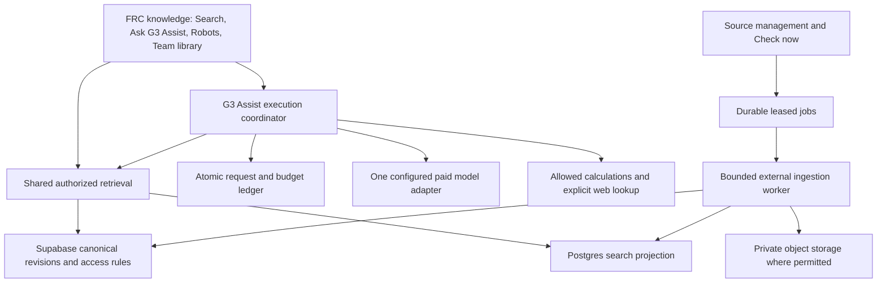

# Connected knowledge: production audit and revised decisions

Status: read-only audit and design, 20 September 2026. This document supplements and takes precedence over conflicting assumptions in `KNOWLEDGE_ARCHITECTURE_REVIEW_20260920.md`. No application implementation, production schema/data change, import, deployment, compute upgrade, provider switch or paid AI request was performed. The Supabase SQL editor auto-saved a private audit query snippet as part of its normal UI operation.

## What was actually inspected

Authenticated Supabase production dashboard, organization Usage, deployed `frc-assistant` source, function overview/logs, and read-only SQL against production project `hnqwhuuxlqfyawqymaaz`. SQL used read-only transactions ending in rollback. Inspected relevant table existence, RLS policies, helpers, grants, triggers, indexes, database size, aggregate storage/chat counts and installed extensions. No private conversation contents or API secret values were collected. Relevant local code paths are listed in the architecture review.

This verifies the current knowledge/assistant boundaries; it is not a penetration test, exhaustive audit of unrelated application modules, production load test or proof of past failure causes. A system-wide claim would exceed the evidence.

## Production measurements

Observed approximately 17:52–18:05 UTC; dashboard usage can lag and period aggregates differ from instantaneous SQL values.

| Item | Observed result | Meaning |
|---|---|---|
| Organization | Pro | Subscription is confirmed. |
| Production compute | Nano, `t4g.nano`, Mumbai | Pro subscription does not establish large database compute capacity. |
| Database bytes | 40,234,131 | About 40.23 MB currently; excludes object files. |
| Momentary utilization | CPU 3%, RAM 53%, disk indicator 4%; 14/60 connections in overview, 22 sessions at SQL inspection | Light sampled load; not a concurrency benchmark. |
| Recent overview | 3,943 requests / 24 h; 99.8% success | Overall project metric, not an assistant reliability measurement. |
| Latest backup indicator | 17 hours earlier | Restore and object recovery were not tested. |
| Current storage objects | 12; metadata sum 10,176,996 bytes | SQL snapshot, not organization period-average storage. |
| Organization storage quota/usage | 100 GB included; 0.07 GB average in displayed period | Substantial object-storage headroom at current usage. |
| Organization egress | 250 GB included; 0.15 GB used; cached egress separately 0.01/250 GB | Current consumption is small. |
| Edge invocations | 899 / 2,000,000 in displayed period | Not a limitation at current usage. |
| Auth activity | 30 / 100,000 monthly active users | Different from active concurrent users. |
| Usage notice | Overages currently not billed; restrictions possible at included limits | Do not assume unlimited automatic overages. |
| Disk allowance shown | 8 GB included per project | Billing allowance differs from compute sizing and currently provisioned disk. |
| Installed extensions checked | `pg_stat_statements`, `pg_cron`; no `vector`, no `pgmq` | Vector/queue capability is not installed merely because Supabase supports it. |

The dashboard's Nano compute label is authoritative for the observed instance. Official documentation describes Nano as up to 0.5 GB RAM with a 500 MB recommended database size; Micro has 1 GB RAM and a 10 GB recommended database size, approximately $10/month before organization compute credits. The observed Pro/Nano combination should be reconciled in project compute/billing settings before any upgrade; no upgrade or final invoice amount is assumed. [Supabase compute documentation](https://supabase.com/docs/guides/platform/compute-and-disk).

The cumulative database temporary-file counter was about 28.9 GB with no reset timestamp. It is not current disk use, and cannot be attributed to this assistant from that aggregate. No conclusion about a current performance incident follows from it.

### What is deployed versus local

- Production has **1 knowledge article**, **48 published evidence claims**, and **6 saved assistant messages** (3 user, 3 assistant). These are exact aggregate counts at inspection.
- Production does not have `frc_research_topics`, `frc_robot_configurations`, `frc_knowledge_checks` or `frc_knowledge_documents`. The new source-check function is absent from the deployed function list.
- The local collection remains **1,716 source versions, 48,797 unique passages, 50,157 citation occurrences, 121,544,704 indexed bytes**. That is not production data. Coverage remains incomplete; source indexing is not robot-fact verification.
- Saved assistant messages name `gemini-3.6-flash`; latest saved message is 28 August 2026. This tiny successful-message sample cannot measure failure rate, adoption or comparative model quality.
- The deployed function was updated 16 days before inspection. Its selected Last 5 days log view returned no results. Earlier reported failures have not been reconstructed.

**Capacity decision:** keep the 500-team target. Current evidence does not justify reducing to 300 to save storage. Before import, measure the final schema, indexes and query workload in hosted staging. Plan for at least Micro-class compute for the expanded workload rather than treating Nano as already qualified; choose the final size from the benchmark and confirm billing before changing it. Use one bounded ingestion worker initially. No dedicated search cluster is justified by the present corpus.

As arithmetic only, 40.23 MB existing database plus 121.54 MB local index is about 161.8 MB. This is not the final database forecast: canonical versions, permissions, production indexes, revisions, vector indexes, WAL and headroom must be measured. For scale intuition, 48,797 vectors of 1,536 float32 dimensions alone would be about 300 MB before any index or row overhead. This is why vectors should be evaluated selectively instead of assumed free.

## Verified trust and execution gaps

1. **Article verification can be changed by its author.** Live article UPDATE policy permits owner or admin, authenticated grants include UPDATE of `verified`, and there is no article trigger invalidating verification after edits. Anonymous column grants alone do not imply anonymous write access: RLS still applies. Replace the boolean-as-trust-boundary with immutable revisions and a privileged review transition. As an immediate compatibility measure, enforce reviewer-only verification and invalidate it on content/source changes. Do not test this by altering a real production article.
2. **Assistant context is not question-ranked.** The deployed code selects eight articles ordered by verification/recency and six recent resolved issues. An older relevant solution can be missed. Use shared authorized retrieval instead.
3. **Service-role context access needs narrowing.** The function checks active membership and conversation ownership but uses service-role reads, including a supplied issue ID. Record access must be checked using the caller's permissions; do not inherit bypass behavior into private evidence/CAD/telemetry retrieval. Current production issues are empty; unauthorized disclosure was not exercised.
4. **Free-tier/tool compatibility is a concrete concern.** Every text-only request enables `google_search`; image requests do not. Google's current pricing lists grounding as unavailable on the free API tier for the configured models, with a footnote about testing in AI Studio. That is a compatibility risk if this deployment really uses a free project, not proof of the cause of earlier failures. [Google pricing](https://ai.google.dev/gemini-api/docs/pricing).
5. **Retry and accounting behavior can worsen failures.** There can be two attempts across each of four models, without an explicit overall timeout. Project quota exhaustion need not be fixed by choosing another model: Google quotas are project-scoped. The daily application limit counts saved successful user messages, before execution, without an atomic reservation. Failed attempts and concurrent races are not reliably covered. [Google rate limits](https://ai.google.dev/gemini-api/docs/rate-limits).
6. **A citation is treated as grounding.** Any citation makes `grounded=true`. Replace this with resolved citation IDs, source revision/applicability and explicit support status; source support still needs evaluation, not just a code check.

The database advisor also showed 12 findings, including security-definer scouting views. Their severity/exploitability was not established here. Before strategy answers can query those views, review their grants and caller scope; do not expose them to the assistant as arbitrary SQL tools.

## Provider decision: fix reliability first, select quality with evidence

**Do not rely on Gemini's free tier for the production team assistant. Do not make an unconditional OpenAI migration solely because the free tier had problems.** Paid Gemini is the lowest-change operational option; OpenAI Responses is a serious alternative, not a demonstrated winner on this team's questions yet. Both providers have rate limits and possible service failures.

The architecture decision is firm: retain G3 Assist, own retrieval/citations/history in Supabase, and implement a small provider adapter. Use one paid primary at launch. Keep the second adapter available for a controlled comparison and later explicitly configured fallback; do not silently send private material to another provider. Do not make multiple paid model calls for every answer.

Model candidates for the initial same-context evaluation: paid `gemini-3.6-flash` as the deployed-model baseline and OpenAI `gpt-5.6-terra` through Responses as the balanced alternative. Cheap models or expensive deep-reasoning tiers are later optimizations after measured need. This is a candidate selection, not a claim of proven relative answer quality. [OpenAI model catalog](https://developers.openai.com/api/docs/models).

Use 60 versioned EN/HE cases with identical authorized evidence, prompt goals and output constraints. Include debugging PID, elevator design constraints, current-rule conflicts, strategy calculations, images, missing evidence, malicious source instructions and forbidden records. Mentor-score factual support and usefulness blind to provider. Reject a candidate that fails access/citation/rules gates. Compare p95 latency, error behavior and actual billed usage. If both pass with no material quality advantage, retain paid Gemini to avoid unnecessary migration. Select OpenAI if it demonstrates a meaningful quality/reliability advantage at the agreed cost. The comparison is bounded work within implementation, not an indefinite research phase.

### Illustrative generation costs, not a forecast

For **1,000 answers**, each with **6,000 input tokens and 1,000 total billed output tokens**, uncached standard text rates observed 20 September 2026:

| Candidate | Input / output per million tokens | Illustrative total |
|---|---|---|
| Gemini 3.6 Flash, current promotion through 31 December 2026 | $0.75 / $3.75 | $8.25 |
| Same model, published rates from 1 January 2027 | $1.50 / $7.50 | $16.50 |
| OpenAI GPT-5.6 Terra, short-context standard | $2 / $12 | $24 |

Excludes extra reasoning/output tokens beyond the assumption, retries, web tools, images, embeddings, storage, taxes and infrastructure. Actual prompt/history length and answer complexity matter. These figures do not establish comparative value. [Google pricing](https://ai.google.dev/gemini-api/docs/pricing), [OpenAI pricing](https://developers.openai.com/api/docs/pricing).

OpenAI API data is not used for training by default; that does not mean zero retention. Standard abuse-monitoring retention can include content for up to 30 days, with documented exceptions. Use `store:false`, own conversation state, minimize private context and verify the selected account's policies. Google's pricing distinguishes free and paid data-use treatment. Do not treat a consumer chat subscription or Supabase Pro subscription as an AI API entitlement. [OpenAI data controls](https://developers.openai.com/api/docs/guides/your-data).

## Final architecture for the next increment

Concrete implementation boundaries:

- **Existing UI and workflows stay authoritative.** One FRC knowledge entry; searchable source passages and reviewed robot configurations are visibly different. Existing G3 Assist remains globally accessible. Preserve conversation history, images, Save knowledge, Create issue and Create task.
- **One retrieval contract.** Exact IDs, aliases, lexical ranking, topic/season constraints, deduplication and source diversification on the server. Return 20 results per page with stable cursors. Broad PID searches first show a small grouped set such as Explanation, Tuning, Troubleshooting and Robot examples, with explicit matching logic. Groups do not imply verified robot attributes. Semantic retrieval is a measured enhancement for paraphrases/HE, not a prerequisite for exact filtering.
- **Useful answers.** “Our elevator oscillates near the target” retrieves relevant control references and permitted team fixes, separates likely causes from observations, asks for missing material measurements and gives an ordered test plan with citations. “Which robots used elevators?” returns only documented robot associations as confirmed matches; related unreviewed passages are separately labelled. “Best strategy this season?” uses a pinned rules revision and timestamped match data, with arithmetic executed by a validated calculator and assumptions shown.
- **Canonical source and knowledge revisions.** Stable source/version/passage IDs, occurrence locators, immutable reviewed claims, article revisions, entity links and explicit applicability. Preserve historical facts without confusing them with current legality. AI saves create drafts; an answer cannot verify itself.
- **Authorization before ranking and generation.** Apply caller access to results, facets, counts, selected evidence, cached answers and citations. Restricted private uploads have the same scope in object storage and derived indexes. No direct browser access to privileged corpus queries.
- **Durable ingestion.** Start with a Postgres job table using atomic claims, leases, checkpoints and stage idempotency; this avoids assuming `pgmq` is installed. One restricted server-side worker performs downloads/extraction outside short-lived Edge requests. Edge functions authenticate/enqueue/status/search/coordinate answers. Worker host is a deployment choice to confirm before release, not a reason to redesign the data contract. Enforce publisher allowlists, redirect/private-network checks, file/type/size limits, parser isolation, extraction quarantine and source rights.
- **Bounded AI execution.** Proposed initial standard mode: one active request per member, three provider requests concurrently per team, 6,000-token retrieved-context budget, 2,000 billed output-token cap, 45-second overall deadline, at most one transient retry within it. Respect Retry-After and stop quota/billing errors instead of traversing four models. Tune these initial settings from account limits and evaluations. Streaming progress, cancellation and deterministic search remain available. Reserve budget atomically for worst-case attempts; record each attempt independently of chat persistence and reconcile uncertain charges conservatively.
- **Explicit web lookup.** Prefer indexed evidence. Use web lookup only for freshness or a documented coverage gap, under source/cost/privacy rules. Do not leak private issue descriptions through search queries. Current web results are provisional until captured as source versions.
- **Manageable operations.** Admin sees discovery, fetch, extraction, indexing, quarantine, review and freshness separately; coverage by season/topic, worker backlog, failed stages and AI spend. Check now coalesces jobs. No five-minute polling. Model and prompt versions, index generations and source changes are auditable. Cache keys include permissions and revisions; revocation invalidates answers as well as search.

## Delivery order and acceptance

| Order | Concrete result | Estimate |
|---|---|---|
| 1 | Staging copy/schema inventory, article review protection, caller-scoped context and execution/budget ledger | 3–5 engineering days |
| 2 | Canonical import of the existing corpus, stable citations, durable worker and shared authorized search | 4–6 days |
| 3 | Unified search/Ask flow, useful answer formats, existing handoffs, model adapter and bounded provider comparison | 4–7 days |
| 4 | EN/HE/mobile/RTL/accessibility review, role tests, load/restore/failure tests, operational dashboard and release evidence | 4–7 days |

Total planning range **15–25 engineering days**, subject to the stated acceptance scope, provider access and worker hosting. No new corpus-wide collection is required to begin. All of this increment can be implemented and evaluated remotely; robot advice still needs physical validation before becoming measured team knowledge.

Release gates: authenticated member/mentor/admin/inactive-member fixtures; no unauthorized snippets/counts/citations; review invalidation; retry/quota/cancel/save-failure accounting; source-change and restore drills; old search/assistant/handoff regression checks; EN/HE keyboard/mobile/RTL inspection. Hosted staging must meet the original search target (p95 <=2 seconds at 20 concurrent searches on current corpus) while ingestion runs at its capped rate, and must record database/index size, memory, connections and cost. Scale fixtures are synthetic and never published as evidence. Zero regressions is the objective enforced by these gates, not an absolute guarantee from a design document.

## Remaining evidence gates, with exact reasons

1. **Gemini account:** Sign-in completed and the selected G3-6740-AI project was inspected; see the follow-up below. Free tier and model quotas are verified, and aggregate error categories are available. Request-level logging is disabled and requires billing, so exact historical error causes remain unconfirmed. The deployed secret was not compared with this project's API key; account association is supported by the selected project and model history, not a credential match. A current `GEMINI_MODEL` override was not read.
2. **OpenAI account and evaluation:** No paid API call or account quota check occurred. Provider superiority and production rate limits must be established before provider cutover; the architecture does not depend on which adapter wins.
3. **Hosted staging:** The expanded schema/index does not yet exist in production. Its exact footprint, relevance and concurrent performance cannot truthfully be measured before constructing and testing it in staging. Current live capacity and policies have now been inspected; this is a future workload measurement, not another omitted live check.
4. **Operations:** Object restore, worker hosting, compute/billing reconciliation and advisor view review remain release tasks. No production mutations were made to close them during design.

The architecture is a concrete, evidence-based decision now. Production readiness remains conditional on these explicit tests and account checks. Calling either the model choice or future capacity “proven” before those checks would repeat the original mistake.

## Signed-in Google AI Studio follow-up — 20 September 2026

Read-only inspection of user-selected **G3-6740-AI**, project `gen-lang-client-0196794219`, confirmed **Free tier** with Set up billing offered. No billing, keys, logging settings or model configuration was changed; no generation request was made.

The 28-day Rate Limit view loaded the following account-specific values (peak observed usage / current limit):

| Model | Requests/minute | Input tokens/minute | Requests/day |
|---|---|---|---|
| Gemini 3.6 Flash | 1 / 5 | 1.76K / 250K | 4 / 20 |
| Gemini 3.7 Flash | 1 / 5 | 310 / 250K | 5 / 20 |

These are project/model limits, not allowances per student. For the default 3.6 model, 20 students making one single-attempt request each could consume the entire daily allowance. The application's 20-successful-messages-per-member rolling limit is therefore not aligned with the provider allowance. Account peaks shown below the current limits do not explain historical 429s; current quotas, aggregation and request methods are insufficient to identify the exhausted quota.

The Usage chart exposed actual error series. Expanded date columns showed:

| Displayed chart date | API requests | 404 NotFound | 429 TooManyRequests | 503 ServiceUnavailable |
|---|---:|---:|---:|---:|
| 29 August | 10 | 1 | 0 | 5 |
| 31 August | 5 | 0 | 2 | 0 |

Dates are the chart's displayed daily buckets (its accessibility description specifies UTC-8), not converted application timestamps. These are provider requests, which may include retries or tests, not unique student questions. The inspected dates are not asserted to be the entire project's lifetime totals. Usage also lists Gemini 3.7 Flash, beyond the deployed source default; this alone does not establish a current override or which application made those calls.

Logs and Datasets shows **Disabled** and **Set up billing to enable Gemini API logging**. Detailed request/error bodies therefore cannot be reconstructed from this surface. A 404 establishes a not-found response, not which model/resource was unavailable. A 503 establishes service unavailability, not a guaranteed free-tier-specific cause. A 429 establishes rate/quota rejection, not which exact quota was exhausted. The deployed `store:false` behavior must remain part of the privacy design; do not enable prompt logging merely to obtain metrics.

**Decision strengthened, not replaced:** the verified daily limit is too restrictive for the intended team-wide assistant. Use a paid primary, retain the shared retrieval/ledger/timeout design, and distinguish configuration/not-found errors from transient service failures and exhausted quotas. Paid Gemini remains the lowest-change baseline; the evidence does not prove OpenAI would produce better answers or eliminate outages. The same-context provider comparison remains the cutover criterion. Do not promise that upgrading billing fixes every observed failure.
